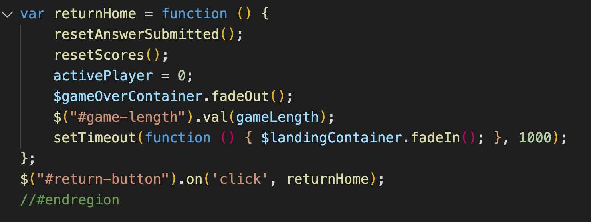

# Sol System Trivia
By C. Marshall Moriarty
### A two player, 20 question trivia game about the Solar System.
https://moriarty83.github.io/sol-system-trivia/

## Features
- Games of 1-20 questions about the Solar System
- 20 Cool images and text from NASA accompany every answer.
- Mobile First Design
- Randomized question order.
- Mercy Rule - If a player gets ahead by 15+ points, they automatically win.
- Entire game played on a single page (no reloads)

## How to Play
Sol System Trivia is a game meant for two players on a single mobile phone or other device. A phone is suggested becaues it's easily passed between players. 

1. Once a game length is specified and game begun, a Player 1 is prompted with a question. They select an answer and submit it, then hands the device to Player 2 to submit an answer to the same question. 

2. Once both players have answered the question, the answer is provided for both players to look at, points asigned. The Proceed button is pressed, the process begins anew with a new question being prompted for Player 1. 

3. When the number of questions equal to the Game Length that was set is reached, the game is over. Players are shown a synposis screen and they can then return to the home screen to play again.

#### Scoring
- Correct Answer: +3 Points
- Incorrect Answer: -1 Point
- Pass: 0 Points

## Technologies
- TypeScript
- JavaScript
- HTML
- JQuery
- AJAX
- Headless API
- CSS

## Goals/Update Objectives
- COMPLETED! Mercy Rule - If one player is more than 15 points ahead, the game
- COMPLETED! Variable game length. 
- Save game progress in local memory.
- Code Optimization - Build something akin to a Finite State Machine for game states.

## Wireframe/Screenshots

  

## To Do
- Tweak CSS for very small/older phones.
- Create Error Page/Text if API fails to load.
- COMPLETED! FadeIn/Out on question change.
- COMPLETED! Make radio buttons reset to one.
- COMPLETED! Scroll to top every time turn changes.

## Issues
- Reload bug: Page seems to unexpected reload for unknown reason resetting game. Only seems to occure when hosting locally.
- Minor Copy Editing Needed for Questions.
- Some questions have incorrect images.
- Fade in/out Transitions can be a bit funky.
- Footer flows to top of page during transitions.

## MVP Fulfillments
1. Question model with a Headless CMS built on Contentful consisting of 20 questions.

2. Pull those questions into your website using an AJAX call. 

3. Mobile-First Design. Primarily using Flex-Box & Media Queries.

4. Readme Documentation on your project.
    You're lookin' at it.

## Stretch Goals
1. Create a reset button to replay the game without refreshing the page.

2. Add Win Conditions where a player wins at a certain score and is notified.
