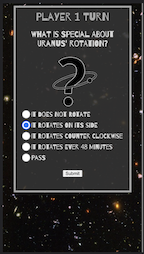

# Sol System Trivia
By C. Marshall Moriarty
### A two player, 20 question trivia game about the Solar System.

## Features
- 20 questions, images of the Sol System.
- Mobile First Design
- A cool picture to accompany every answer.
- Randomized question order.

## Technologies
- Headless API
- TypeScript
- JavaScript
- CSS

## Goals/Update Objectives
- COMPLETED! Variable game length. 
- Save game progress in local memory.

## Wireframe/Screenshots

  

## To Do
- FadeIn/Out on question change.
- Make radio buttons reset to one.

## Issues
- Reload bug: Page seems to unexpected reload for unknown reason resetting game.
- Copy Editing Needed for Questions
    - What is the solar system's largest Asteroid: Eros appears twice.
- Some questions have incorrect images.